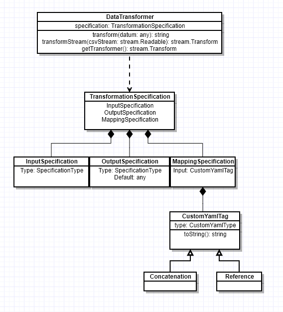

# data-transformer

## Assumptions
 * Raw CSV data will be available as a stream
 * Mapping specification will be available in YAML format according to the DSL
 * Numbers will have decimal, not comma, separators

## Dependencies
 * [js-yaml](https://github.com/nodeca/js-yaml) to parse YAML files and apply custom tags
 * [csv-parse](https://github.com/adaltas/node-csv-parse) to parse CSV files
 * [stream-transform](https://github.com/adaltas/node-stream-transform) an extension of [Transform](https://nodejs.org/api/stream.html#stream_class_stream_transform) used for ease and readability when transforming data in a stream

## Mapping DSL
The mappings should be defined in YAML format. Examples can be found in [the examples folder](https://github.com/champgm/data-transformer/tree/master/examples). The specification should include three top-level sections, `InputSpecification`, `OutputSpecification`, and `MappingSpecification`. Input and Output fields must have a Type, valid values are detailed below. Output fields may include a specified `Default` value. `MappingSpecification` objects' `Input` fields should consist of one or more custom YAML types, also detailed below.

### Supported Input and Output Types
 * Number
 * Date
 * Boolean
 * String

### Supported Custom YAML Types
 * `!Concat` - String construction, somewhat similar to [CloudFormation's !Join](https://docs.aws.amazon.com/AWSCloudFormation/latest/UserGuide/intrinsic-function-reference-join.html) but without a delimiter
 * `!Ref` - References values in the InputSpecification section of the YAML file

## Architecture / How It Works
Given a valid mapping specification, the `DataTransformer` class parses that specification with `js-yaml`, augmenting the default YAML schema with a custom schema containing definitions for the currently supported `CustomYamlType`s. The `DataTransformer` instance can then be used to create a stream from a stream of CSV records or it can produce an instance of `stream.Transform` that can be used in streams outside of this library. 

The parsed `TransformationSpecification` object contains default values (if defined) as well as transformation functions tailored to the values defined in the specification file. Each datum is given to the `DataTransformer`'s `transform` method, where it uses those default values and transformation functions to map datum values into the proper format defined by the `OutputSpecification`.



# Setup and Demonstration
The project depends on Node.js and NPM. You can find out more about how to install those [here](https://www.npmjs.com/get-npm). Once that's taken care of, ideally, all project dependencies should be installed by running the following command:
```bash
npm install
```

There are two example scripts in the `examples` folder. Each transforms example data using different method. They can be run with one of the following commands:
```bash
npm run example:stream
npm run example:transform
```

There is also a convenience command to process custom example data with user-defined specifications. Running that looks something like this:
```
⇒  npm run example:input

> data-transformer@1.0.0 example:input /Users/gchampion/github/data-transformer
> ts-node examples/custom-input-example.ts

? Input the path to the specification file you wish to transform examples/TransformationSpecification.yml
? Input the path to the CSV file you wish to transform examples/ExampleInput.csv
Loading example CSV input from file, 'examples/ExampleInput.csv'...

Loading transformation specification from file, 'examples/TransformationSpecification.yml'...

Outputting data from DataTransformer's configured stream...
<<Data output here>>
```

## Library Usage
I have also published this package to NPM as [gmc-transformer](https://www.npmjs.com/package/gmc-transformer). You can see an example of it used as a library in `examples/library-example.ts` or you can use it your own project by importing it. That would look something like this:
```
import { DataTransformer } from 'gmc-transformer';
```

# Next Steps
 * Make transformations more robust, especially `Date` and `Number`
 * Make delimiter and other parsing options configurable (or flesh out documentation on self-configuring `csv-parse` and using the data transformer directly)
 * Support more Types, possibly even nested objects
 * Support more transformation types, maybe `!Sum`, `!Difference`, `!Uppercase`, whatever is needed
 * Allow multiple `InputSpecification` definitions to join and transform data sets
